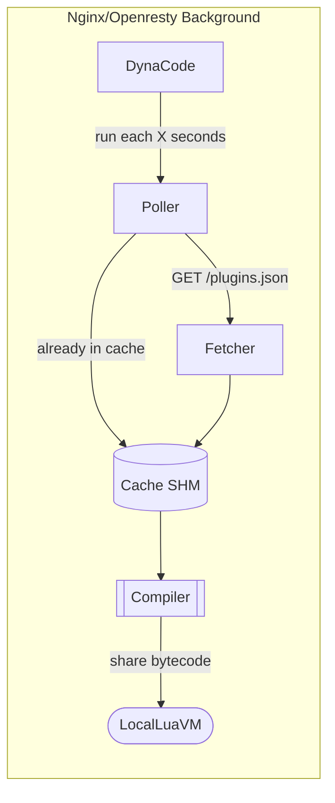
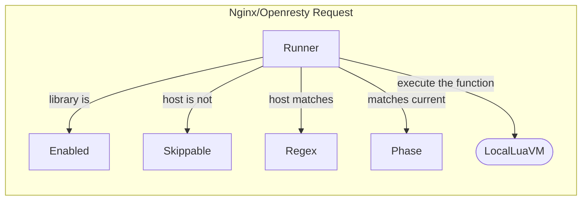

# Lua Resty Dynacode

An openresty library provisioning dynamic (via JSON/API) load of lua code into the nginx/openresty.

# How

You create a CMS where you register **plugins**. A plugin belongs to a **server/domain** (`*`, regex, etc), it has an **nginx phase** (access, rewrite, log, etc), and the **lua code** it represents. Your CMS then must expose these plugins in [a known API/structure](/usage/response.json).

```yaml
domains:
  - name: "webp.local.com"
    plugins:
      - name: Only_Webp
        code: "if not ngx.re.find(ngx.var.uri, '\\\\.webp$') then ngx.exit(ngx.HTTP_NOT_FOUND) end"
        phase: access
      - name: Create_Webp
        code: "ngx.say('this is a webp file, believe')"
        phase: content
  - name: "gateway.local.com"
    plugins:
      - name: Authorized
        code: "if ngx.var.arg_token ~= '0xcafe' then ngx.exit(ngx.HTTP_UNAUTHORIZED) end"
        phase: access
```

Once a JSON API is running, the openresty/nginx will `fetch` regularly the plugins (**in background**), `compile` them, and save them to cache. When a regular user issues a request then the `runner` will see if the current context (server name, phase, etc.) matches with the **plugin spec/requirements**, and run it.

# Motivation

Do what we already do with Lua, but without SIGHUP or deployment. It was [inspired by a previous hackathon](https://github.com/leandromoreira/edge-computing-resty#demo). Things this library enables you to do:

* Debug (log/metrify specific IP/token/user agent/cookie)
* Quick maneuvers:
  * Block IP
  * Deny requests per path/user agent/etc
  * Drain a single server (302) / health check
  * Turn on/off modules/variables
  * ...
* Chaos testing
* Change any variables
* Modify response body
* Add response header (CORs, SCP, HSTS, X-Frame-Options,
 ...)
* Really anything you can do with lua/openresty

# Example (Quick Start)

You can find a complete example in the [`usage`](/usage) folder. The following steps will guide you through the basic usage:

Install the library `luarocks install resty-dynacode`

Create a lua module to import and configure the library.

```lua
local dyna_controller = require "resty.dynacode.controller"
local controller = {} -- your module

dyna_controller.setup({
  plugin_api_uri = "http://api:9090/response.json", -- the API providing the expected response
  plugin_api_polling_interval = 15,
  plugin_api_poll_at_init = true,
  workers_max_jitter = 5,
  shm = "cache_dict",
})

function controller.run()
  dyna_controller.run()
end

return controller
```

And finally hooking up the phases at the nginx conf.

```nginx
http {
  # you must provide a shared memory space for caching
  lua_shared_dict cache_dict 1m;
  # spawning the pollers
  init_worker_by_lua_block   { require("controller").run() }
  # hooking up all the phases (on http context)
  rewrite_by_lua_block       { require("controller").run() }
  access_by_lua_block        { require("controller").run() }
  header_filter_by_lua_block { require("controller").run() }
  body_filter_by_lua_block   { require("controller").run() }
  log_by_lua_block           { require("controller").run() }

  # the servers we want to add lua code
  server {
    listen 7070;
    server_name  gateway.local.com;

    location / {
      proxy_pass http://$gateway_upstream;
    }
  }

  server {
    listen 8080;
    server_name  webp.local.com;

    location / {
      content_by_lua_block { require("controller").run() }
    }
  }

}
```


# How it works

* in the **background**:
  * start a [poller](/src/resty/dynacode/poller.lua#L40)
  * fetch the [JSON API response](/usage/response.json) and save it to a [**shared memory**](/src/resty/dynacode/cache.lua#L67)
  * compile (`loadstring`) the lua code and share it through [**each worker**](/src/resty/dynacode/controller.lua#L157)
* at the **runtime (request cycle)**:
  * select the proper domain (applying [regex against current host](/src/resty/dynacode/runner.lua#L88))
  * select the applicable plugins (based on phase/applicability)
  * [run them](/src/resty/dynacode/runner.lua#L102)

## Background 



## Request



# Observability

One [can use events](usage/src/controller.lua#L73) to expose metrics about the: `poller`, `fetcher`, `caching`, `compiler`, `runner`, and etc.


# Warning

Although this library was made to support most of the failures types through `pcall`, `fallbacks`, and `sensible defaults` you can't forget that a developer is still writing the code.

The following code will keep all nginx workers busy forever, effectively making it unreachable.

```lua
while true do print('The bullets, Just stop your crying') end
```

While one could try to solve that with [quotas, but Luajit doesn't allow us to use that](https://github.com/Kong/kong-lua-sandbox#optionsquota).

What happens when plugin API is offline? If the plugins are already in memory, that's fine. But when nginx was restarted/reloaded, it's going to `"lose"` all the cached data.


# Road map

* ~~publish a rock~~
* off-line mode (saving a local api response for -HUP/restart without link to API)
* ~~use / provide function direct access / local function instead of tables (`ngx_now`, `tbl.logger`)~~
* ~~discuss the json format (making phases accessible without iterating through all plugins)~~
* ~~offer events callbacks (like: `on_compile_fail`, `on_success`, `...`)~~
  * maybe a vts plugin for metrics
* ~~tests~~
* ~~documentation~~ / ~~drawing~~ / ~~use cases~~
* build, ~~lint~~
